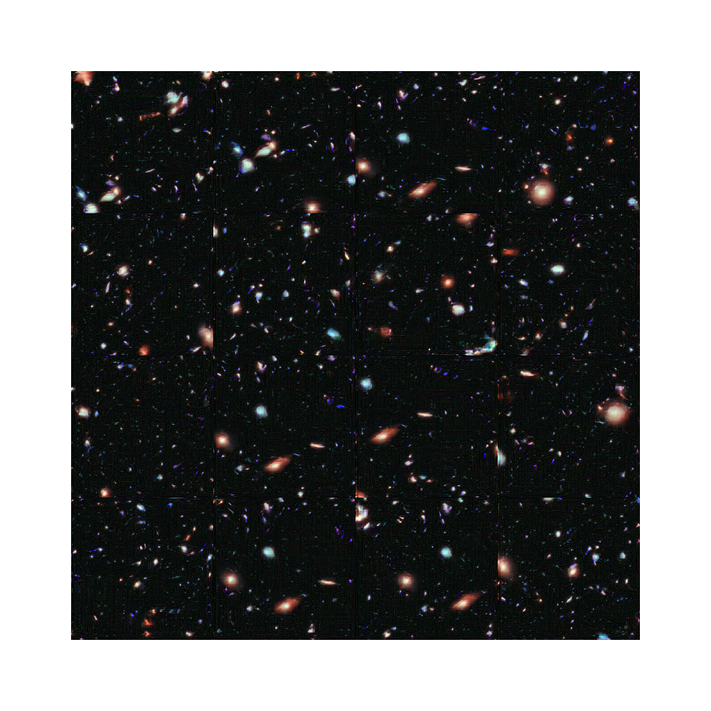
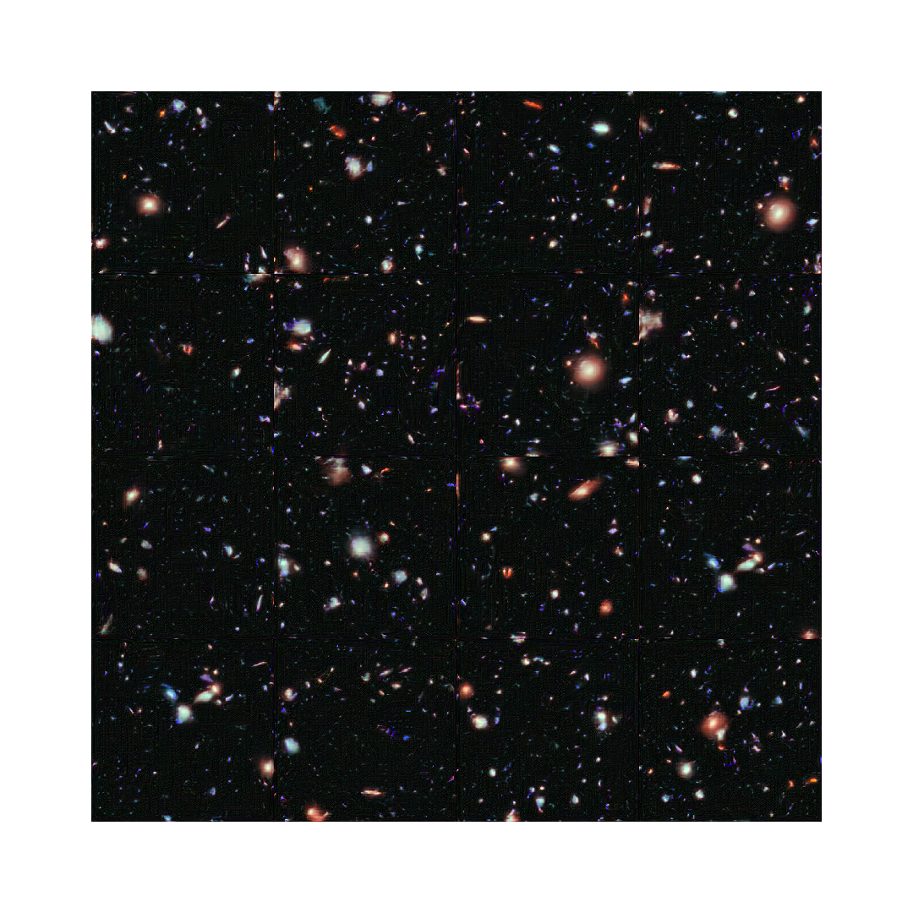

# DeepHubble

Explore GANs by building one that can generate high quality image of deep space (akin to images taken by the Hubble Telescope).

## Data

The data consists of images sampled from the larger Hubble eXtreme Deep Field (XDF).

## [Pro-GAN](https://github.com/antoniojkim/DeepHubble/tree/master/model/Pro-GAN)

I was able to replicate the results of the Pro-GAN architecture described in [this paper](https://arxiv.org/pdf/1710.10196.pdf) by Nvidia. With this I was able to generate relatively high quality images resembling the Hubble eXtreme deep field.

### Methodology

The main idea behind the Pro-GAN architecture is to progressively grow the size of the GAN incrementally, in order to produce faster and more stable training results.

Due to hardware constraints, I modified the architecture described in the paper by scaling it down from having a maximum of 512 channels per convolution operator to a maximum of 256 channels. Despite this scaling down, the results appear to be fairly good.

A number of tricks that are mentioned in the paper were employed including an equalized learning rate, a minibatch standard deviation layer, and pixelwise normalization. All of these tricks helped to stablize the training and reduced the chances of encountering mode collapse significantly.
