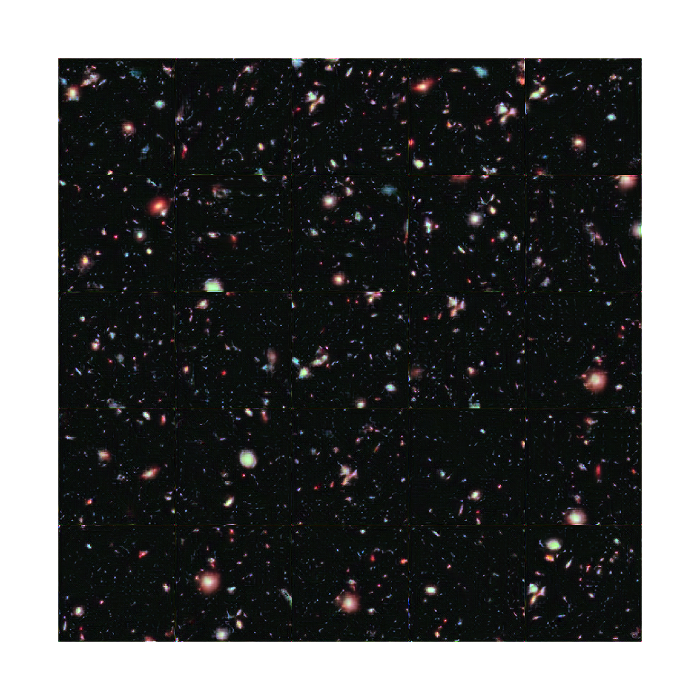

# DeepHubble

Explore GANs by building one that can generate high quality image of deep space (akin to images taken by the Hubble Telescope).

## Data

The data consists of images sampled from the larger Hubble eXtreme Deep Field (XDF).

### [Pro-GAN](https://github.com/antoniojkim/DeepHubble/tree/master/model/Pro-GAN)

I replicated the results of Pro-GAN architecture described in [this paper](https://arxiv.org/pdf/1710.10196.pdf). With this I was able to generate relatively high quality images resembling the Hubble eXtreme deep field.

