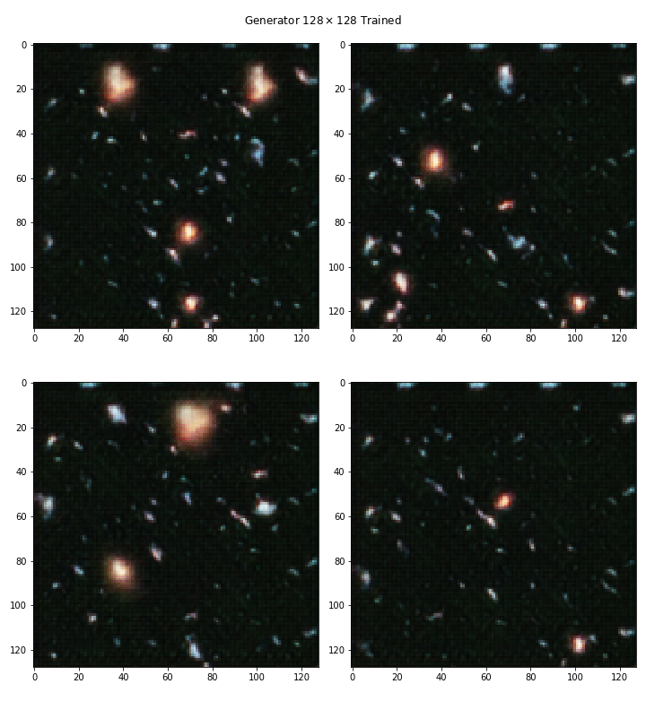

# Experimentation

## [GAN](https://github.com/antoniojkim/DeepHubble/tree/master/model/DCGAN.ipynb)

Initial experimentation with a vanilla GAN as described in [this paper](https://arxiv.org/pdf/1406.2661.pdf) yielded unstable results.

The loss of the discriminator would tend towards zero while the loss of the generator would continue to increase. This tells us that the generator is performing very poorly and the discriminator is catching on and is able to easily identify which images are being generated and which come from the XDF image.

## Pro-DCGAN

In the next experiment, I tried progressively growing the DCGAN to see if that would improve results.

At the end, I found that it did indeed significantly help stabilize the GAN, but only up until a certain point. I was able to generate somewhat decent $128 \times 128$ images as seen below,

However, beyond that, the generator became highly unstable when trying to learn a 256 representation.
