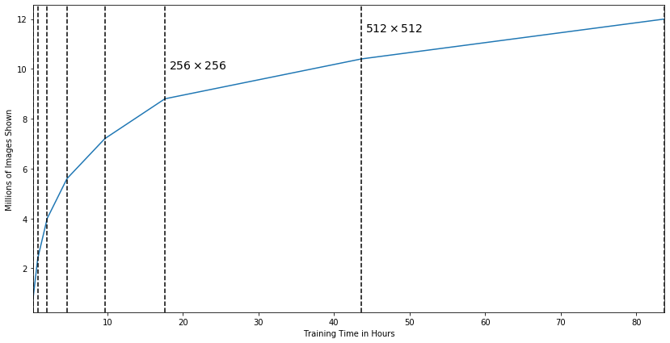
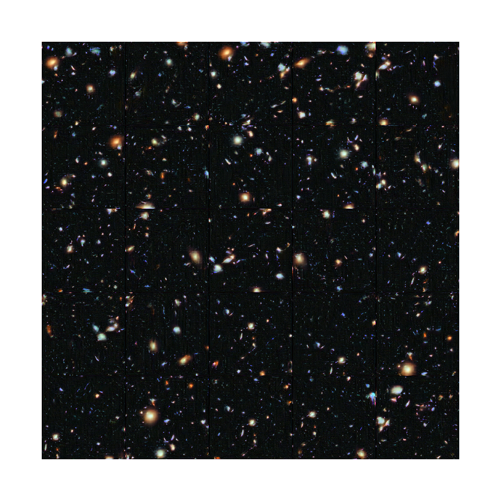

# Pro-GAN

A PyTorch implementation of Pro-GAN as described in [this paper](https://arxiv.org/pdf/1710.10196.pdf).

Many of the custom layers used in this implementation can be found in the [TorchX](https://github.com/antoniojkim/TorchX) package.

## Training Times

| Resolution | Total Images shown | Minibatch Size | Time Spent Training |
|------------|--------------------|----------------|---------------------|
| 4x4        | 800,000            | 64             | 670 seconds         |
| 8x8        | 1,600,000          | 64             | 2216 seconds        |
| 16x16      | 1,600,000          | 64             | 4505 seconds        |
| 32x32      | 1,600,000          | 64             | 9442 seconds        |
| 64x64      | 1,600,000          | 64             | 17980 seconds       |
| 128x128    | 1,600,000          | 64             | 28649 seconds       |
| 256x256    | 1,600,000          | 32             | 93622 seconds       |
| 512x512    | 1,600,000          | 16             | 144322 seconds      |

## Final Generated Image

